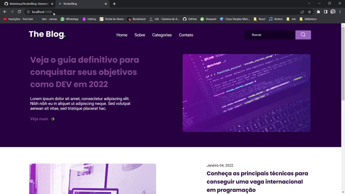

<h1>RocketBlog</h1>
👨‍💻 Landing page para um blog fictício. 
🪄 Pequeno projeto para eu treinar minha estilização baseado em um design feito no Figma. 
🔗 Projeto que eu executei : https://app.rocketseat.com.br/discover/challenges/rocketblog

<h2>Tecnologias utilizadas</h2>
    <h3>Front-end:</h3>
    - React JS  
    - Typescript  
    - Styled Components  
    
<h2>RocketBlog</h2>  

